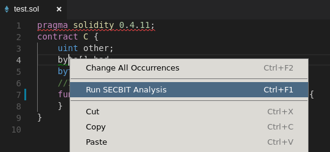
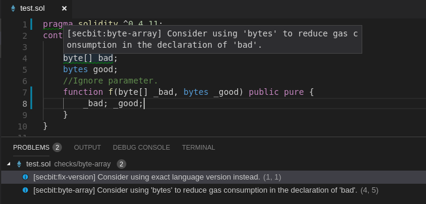

# Visual Studio Code Extension for SECBIT Solidity Static Analysis Extension

This is an [Visual Studio Code Extension](https://marketplace.visualstudio.com/items?itemName=SECBIT.vscode-secbit-ssae) for running SECBIT
Solidity Static Analysis over Solidity source code.

## Features

This extension is an user interface to the [SECBIT Solidity Static Analysis Extension](https://github.com/sec-bit/adelaide)
which extended the [Solidity compiler](https://github.com/ethereum/solidity) to provide
additional diagnostics on known issues and violations of best practices.

The main functionality is provided via the context menu command `Run SECBIT Analysis`.



Triggering this command would run the SECBIT-extended `solc` and report diagnostics generated.



## Currently Supported Checks

### ERC20 Specific

#### approve-no-event
`Error`

[SECBIT: no-Approval](https://github.com/sec-bit/awesome-buggy-erc20-tokens/blob/master/ERC20_token_issue_list.md#b7-no-approval)

#### erc20-no-decimals
`Error`

[SECBIT: no-decimals](https://github.com/sec-bit/awesome-buggy-erc20-tokens/blob/master/ERC20_token_issue_list.md#b4-no-decimals)

#### erc20-no-name
`Error`

[SECBIT: no-name](https://github.com/sec-bit/awesome-buggy-erc20-tokens/blob/master/ERC20_token_issue_list.md#b5-no-name)

#### erc20-no-return
`Error`

[SECBIT: transfer-no-return](https://github.com/sec-bit/awesome-buggy-erc20-tokens/blob/master/ERC20_token_issue_list.md#b1-transfer-no-return)

[SECBIT: approve-no-return](https://github.com/sec-bit/awesome-buggy-erc20-tokens/blob/master/ERC20_token_issue_list.md#b2-approve-no-return)

[SECBIT: transferFrom-no-return](https://github.com/sec-bit/awesome-buggy-erc20-tokens/blob/master/ERC20_token_issue_list.md#b3-transferfrom-no-return)

#### erc20-no-symbol
`Error`

[SECBIT: no-symbol](https://github.com/sec-bit/awesome-buggy-erc20-tokens/blob/master/ERC20_token_issue_list.md#b6-no-symbol)

#### transfer-no-event
`Error`

ERC20 transfer functions should emit Transfer event in some cases.

#### transfer-no-revert
`Error`

ERC20 transfer functions should revert in some cases.

#### transferfrom-no-allowed-check
`Warning`

No check on `allowed` within a ERC20 `transferFrom()` function.

#### approve-with-balance-verify
`Warning`

[SECBIT: approve-with-balance-verify](https://github.com/sec-bit/awesome-buggy-erc20-tokens/blob/master/ERC20_token_issue_list.md#a19-approve-with-balance-verify)

#### short-addr
`Error`

The short-address attack.


### Vulnerabilities

#### blockhash
`Warning`

The return value of `blockhash()` could be controlled by miners.

#### dirty-padding
`Error`

Be aware of "dirty higher order bits".

[Solidity: security considerations](https://solidity.readthedocs.io/en/v0.4.24/security-considerations.html?highlight=dirty#minor-details)

#### int-div
`Warning`

Integer division.

#### forced-ether
`Error`

Conditions on ether balance are not reliable since ether could
be forced into a contract.

[ConsenSys: forcibly sending ether to a contract](https://consensys.github.io/smart-contract-best-practices/known_attacks/#forcibly-sending-ether-to-a-contract)

#### pull-vs-push
`Error`

Avoid DoS by using a [pull payment system](https://consensys.github.io/smart-contract-best-practices/recommendations#favor-pull-over-push-for-external-calls)

[ConsenSys: DoS with unexpected revert](https://consensys.github.io/smart-contract-best-practices/known_attacks/#dos-with-unexpected-revert)

#### private-modifier
`Information`

Data with `private` modifier is still visible.

#### redundant-fallback
`Warning`

Fallback function with a single `throw` is redundant.

#### reentrance
`Error`

The DAO attack. 

[ConsenSys: avoid state changes after external calls](https://consensys.github.io/smart-contract-best-practices/recommendations/#avoid-state-changes-after-external-calls)

This check uses SMT solver.

#### send-vs-transfer
`Warning`

Preferred `transfer()` over `send()` or `call.value()`.

[ConsenSys: Be aware of the tradeoffs between send(), transfer(), and call.value()](https://consensys.github.io/smart-contract-best-practices/recommendations/#be-aware-of-the-tradeoffs-between-send-transfer-and-callvalue)

#### timestamp
`Warning`

`timestamp` could be manipulated by miners.

[ConsenSys: Timestamp Dependence](https://consensys.github.io/smart-contract-best-practices/known_attacks/#timestamp-dependence)

#### tx-origin
`Error`

Avoid using `tx.origin`.

[ConsenSys: avoid using tx.origin](https://consensys.github.io/smart-contract-best-practices/recommendations/#avoid-using-txorigin)

#### unchecked-math
`Error`

Integer over/underflows.

[ConsenSys: integer overflow and underflow](https://consensys.github.io/smart-contract-best-practices/known_attacks/#integer-overflow-and-underflow)

This check uses SMT solver.

### Coding style issues

#### bad-name
`Information`

Event names should start with upper cases and function names should
start with lower cases.

[Solidity: Naming style](http://solidity.readthedocs.io/en/v0.4.24/style-guide.html#event-names)

#### constant-mutability
`Information`

Using deprecating `constant`.

#### delegatecall
`Warning`

Using `delegatecall`.

#### fix-version
`Information`

It is recommended to use a fixed language version.

#### hardcode-addr
`Warning`

Hard-coded address in the contract.

#### implicit-visibility
`Information`

Visibility is not specified explicitly.

#### no-return
`Information`

No return statement in a function that returns value.

#### pure-function
`Information`

Could use a more strict state-mutability specification.

#### revert-vs-require
`Information`

Use `require` instead of `revert`.

#### suicide
`Information`

Using `suicide`.

#### sha3
`Information`

Using `sha3`.

#### throw
`Information`

Using `throw`.

#### type-inference
`Information`

Unsafe type inference.

#### view-immutable
`Information`

Could use a more strict state-mutability specification.

### Gas optimization

#### byte-array
`gas`
`Information`

Reduce gas consumption by replacing `bytes` with `byte[]` when possible.


## Requirements

This extension does not provide Solidity language support. Some other extension, 
such as [solidity-extended](https://github.com/beaugunderson/vscode-solidity-extended),
should be installed for this extension to function properly.

This extension ships with a copy of the `soljson.js` Solidity compiler with [SECBIT extensions](https://github.com/sec-bit/adelaide).
So no local `solc` binary is required by default.
But `soljson.js` does not support SMT-based checks.
If they are needed, a copy of the `solc` Solidity compiler with [SECBIT extensions](https://github.com/sec-bit/adelaide) built with SMT lib is required.
It would be built from source following the same instruction as building a vanilla `solc`.

## Usage

Copy this repository to `~/.vscode/extensions` and reload the IDE.

## Extension Settings

This extension provides the following settings:

```javascript
  // Run ERC20-specific checks.
  "secbit.asERC20": false,

  // Only enable the checks in this list. Enable all checks when the list contains no valid entry.
  "secbit.enables": [],

  // Disable SMT-solver-related checks. This is set to true when using soljson.
  "secbit.noSMT": false,

  // Run SECBIT static analysis on file save.
  "secbit.onSave": false,

  // Path to the SECBIT-extended solc. Use soljson by default.
  "secbit.solc": ""
```

## Known Issues

Being an static analysis tool, false positives and false negatives are unavoidable. Bug reports are welcomed.

## Contact Us

If you run into any issues or have suggestions for us, feel free to [create issues](https://github.com/sec-bit/vscode-secbit-ssae/issues) and pull requests.

## Related Projects

https://secbit.io

- [Awesome Buggy ERC20 Tokens](https://github.com/sec-bit/awesome-buggy-erc20-tokens) - A Collection of Vulnerabilities in ERC20 Smart Contracts With Tokens Affected

- [adelaide](https://github.com/sec-bit/adelaide) - The SECBIT Static Analysis Extension to Solidity Compiler

- [Token Libraries with Proofs](https://github.com/sec-bit/tokenlibs-with-proofs) - Contains correctness proofs of token contracts wrt. given specifications and high-level properties

## License

This extension is open-sourced under the MIT license in the LICENSE file of this repository.